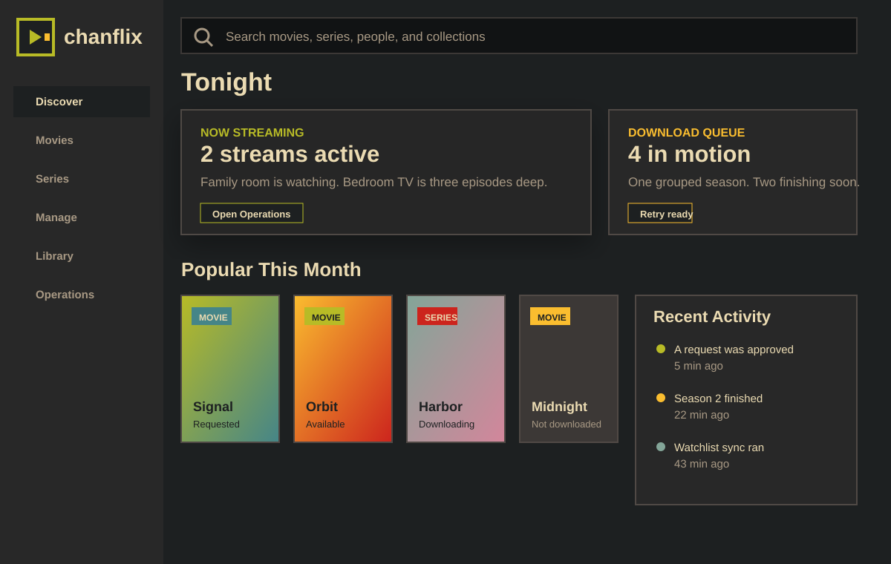

<p align="center">
  
</p>

# Chanflix

Chanflix is a personal media dashboard reshaped around the way this server actually runs.

It still does the request-manager job: Plex users can find movies and series, request them, and let Radarr/Sonarr do the fetching. The fork now leans harder into day-to-day operations: what is streaming, what is downloading, what just finished, what is already in Plex, and what needs a retry.

## Screenshots



## What It Does

- Browse movies, series, trending titles, recent requests, Plex watchlist items, and library shelves.
- Request movies or series, including partial season requests.
- Track live Plex streams through Tautulli.
- Watch active and recently finished Radarr/Sonarr downloads.
- Retry stuck or missing searches from the UI.
- Sync Plex availability and show library items as available, downloading, or not downloaded.
- Keep request tagging tied to the user who asked for the title.
- Keep the inherited notification hooks available.

## Stack

- Next.js + React + Tailwind for the web UI.
- Express for the API server.
- TypeORM + SQLite for local state.
- Plex, Tautulli, Radarr, Sonarr, and TMDB integrations.

## Local Development

Install dependencies, then run the dev server:

```bash
yarn install
yarn dev
```

The app listens on `http://localhost:5055` by default.

Useful checks:

```bash
yarn test:unit
yarn typecheck
yarn build
```

For LAN/device testing with a copied production config, see [CHANFLIX_DEV_SERVER.md](./CHANFLIX_DEV_SERVER.md).

## Deployment

Production deploys should go through:

```bash
scripts/deploy-chanflix-prod.sh
```

That script passes the current Git SHA into the container so `/api/v1/status` can report the deployed commit. The current living tracker is [CHANFLIX_STATUS.md](./CHANFLIX_STATUS.md); the larger handoff notes are in [HANDOFF.md](./HANDOFF.md).

## Notes

This repo still contains inherited code, translations, and API names in places. The public-facing README and branding are Chanflix now; deeper cleanup can happen as the fork keeps drifting into its own shape.
